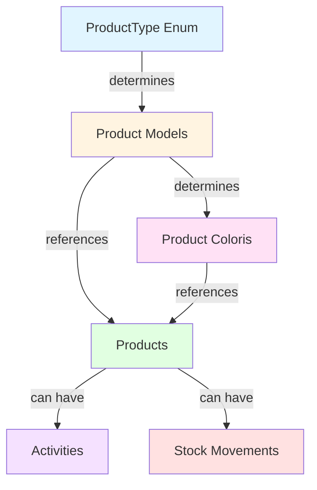
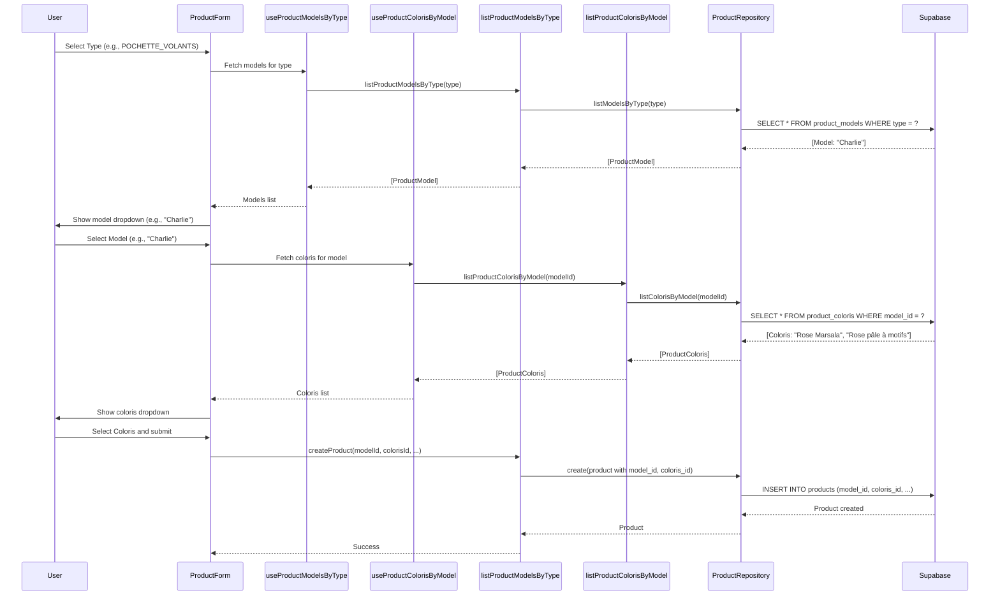
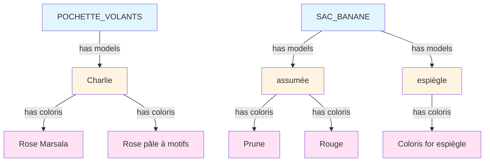

# Product Reference Tables - Relationships Documentation

This document describes the database schema and relationships for product reference tables that enforce valid type → model → coloris combinations.

## Entity Relationship Diagram (Mermaid)

```mermaid
erDiagram
    PRODUCT_TYPE ||--o{ PRODUCT_MODELS : "type"
    PRODUCT_MODELS ||--o{ PRODUCT_COLORIS : "model_id"
    PRODUCT_MODELS ||--o{ PRODUCTS : "model_id"
    PRODUCT_COLORIS ||--o{ PRODUCTS : "coloris_id"
    PRODUCTS ||--o{ ACTIVITIES : "product_id"
    PRODUCTS ||--o{ STOCK_MOVEMENTS : "product_id"

    PRODUCT_TYPE {
        enum SAC_BANANE
        enum POCHETTE_ORDINATEUR
        enum TROUSSE_TOILETTE
        enum POCHETTE_VOLANTS
        enum TROUSSE_ZIPPEE
        enum ACCESSOIRES_DIVERS
    }

    PRODUCT_MODELS {
        uuid id PK
        product_type type FK "ProductType enum (not TEXT)"
        text name
        timestamptz created_at
        timestamptz updated_at
        unique type_name "UNIQUE(type, name)"
    }

    PRODUCT_COLORIS {
        uuid id PK
        uuid model_id FK "REFERENCES product_models(id)"
        text coloris
        timestamptz created_at
        timestamptz updated_at
        unique model_coloris "UNIQUE(model_id, coloris)"
    }

    PRODUCTS {
        uuid id PK
        uuid model_id FK "REFERENCES product_models(id)"
        uuid coloris_id FK "REFERENCES product_coloris(id)"
        numeric unit_cost
        numeric sale_price
        numeric stock
        int4 weight "optional, integer grams"
        timestamptz created_at
        timestamptz updated_at
        note "coloris column removed (use coloris_id FK)"
    }

    ACTIVITIES {
        uuid id PK
        timestamptz date
        activity_type type FK
        uuid product_id FK "REFERENCES products(id)"
        int quantity
        numeric amount
        text note
        timestamptz created_at
        timestamptz updated_at
    }

    STOCK_MOVEMENTS {
        uuid id PK
        uuid product_id FK "REFERENCES products(id)"
        int quantity
        stock_movement_source source FK
        timestamptz created_at
    }
```

## Relationship Flow Diagram



## Data Flow for Cascading Selection



## Valid Combination Examples



## Database Schema Details

### product_models Table

| Column     | Type         | Constraints             | Description                                         |
| ---------- | ------------ | ----------------------- | --------------------------------------------------- |
| id         | UUID         | PRIMARY KEY             | Unique identifier for the model                     |
| type       | product_type | NOT NULL                | Product type enum (not TEXT) - enforces consistency |
| name       | TEXT         | NOT NULL                | Model name (e.g., "Charlie", "assumée")             |
| created_at | TIMESTAMPTZ  | NOT NULL, DEFAULT now() | Creation timestamp                                  |
| updated_at | TIMESTAMPTZ  | NOT NULL, DEFAULT now() | Last update timestamp                               |
|            |              | UNIQUE(type, name)      | Ensures no duplicate model names per type           |
|            |              | INDEX(type)             | Fast filtering by type                              |

### product_coloris Table

| Column     | Type        | Constraints                                          | Description                                 |
| ---------- | ----------- | ---------------------------------------------------- | ------------------------------------------- |
| id         | UUID        | PRIMARY KEY                                          | Unique identifier for the coloris           |
| model_id   | UUID        | NOT NULL, FK → product_models(id), ON DELETE CASCADE | Reference to the model                      |
| coloris    | TEXT        | NOT NULL                                             | Color variation name (e.g., "Rose Marsala") |
| created_at | TIMESTAMPTZ | NOT NULL, DEFAULT now()                              | Creation timestamp                          |
| updated_at | TIMESTAMPTZ | NOT NULL, DEFAULT now()                              | Last update timestamp                       |
|            |             | UNIQUE(model_id, coloris)                            | Ensures no duplicate coloris per model      |
|            |             | INDEX(model_id)                                      | Fast filtering by model                     |

### products Table (Modified)

| Column     | Type          | Constraints                             | Description                                     |
| ---------- | ------------- | --------------------------------------- | ----------------------------------------------- |
| id         | UUID          | PRIMARY KEY                             | Unique identifier for the product               |
| model_id   | UUID          | NOT NULL, FK → product_models(id)       | Reference to the model                          |
| coloris_id | UUID          | NOT NULL, FK → product_coloris(id)      | Reference to the coloris                        |
| unit_cost  | NUMERIC(10,2) | NOT NULL, CHECK (unit_cost > 0)         | Cost per unit                                   |
| sale_price | NUMERIC(10,2) | NOT NULL, CHECK (sale_price > 0)        | Selling price                                   |
| stock      | NUMERIC(10,2) | NOT NULL, CHECK (stock >= 0), DEFAULT 0 | Current stock level                             |
| weight     | INT4          | CHECK (weight IS NULL OR weight > 0)    | Optional weight in grams (integer, not decimal) |
| created_at | TIMESTAMPTZ   | NOT NULL, DEFAULT now()                 | Creation timestamp                              |
| updated_at | TIMESTAMPTZ   | NOT NULL, DEFAULT now()                 | Last update timestamp                           |

**Note**: The `coloris` text column has been removed. Coloris information is accessed via `coloris_id` foreign key → `product_coloris` table.

## Validation Rules

1. **Type → Model Validation**

    - A model can only exist for valid ProductType enum values
    - Each (type, name) combination must be unique
    - Example: POCHETTE_VOLANTS can have "Charlie", but not "assumée"

2. **Model → Coloris Validation**

    - A coloris can only exist for a valid model
    - Each (model_id, coloris) combination must be unique
    - Example: "Charlie" model can have "Rose Marsala", but not "Prune"

3. **Product Creation Validation**
    - A product must reference a valid model_id
    - A product must reference a valid coloris_id
    - The coloris must belong to the model (enforced by foreign key chain)
    - Example: Cannot create product with model_id="Charlie" and coloris_id="Prune" (Prune belongs to "assumée")

## Benefits

1. **Data Integrity**: Database-level validation prevents invalid combinations
2. **Fast Filtering**: Indexed queries for cascading dropdowns
3. **Error Prevention**: Users cannot enter invalid names or coloris
4. **Easy Maintenance**: Add new combinations via reference tables
5. **Consistent Naming**: Standardized model and coloris names across products

## Migration Notes

-   Existing products will be migrated by extracting unique (type, name, coloris) combinations
-   Reference tables will be populated from existing data
-   Products will be updated to reference the new tables
-   `products.coloris` column has been **removed** (data preserved in `product_coloris` table via `coloris_id`)
-   `product_models.type` uses `product_type` enum (not TEXT) for consistency enforcement
-   `products.weight` is INT4 (integer grams, not NUMERIC) to match real-world logistics

## Schema Updates (Migration 003)

After initial migration (002), the following schema fixes were applied:

1. **product_models.type** → Changed from TEXT to `product_type` enum

    - Enforces consistency and prevents variations ("Sac banane", "Sac Banane", etc.)
    - Uses PostgreSQL enum type for data integrity

2. **products.coloris** → Column removed

    - Data is preserved in `product_coloris` reference table
    - Access coloris via `coloris_id` foreign key → `product_coloris.coloris`

3. **products.weight** → Changed from NUMERIC(6,2) to INT4
    - Weights in logistics are always integers (120g, 300g, 780g)
    - Conversion to kg can be done in UI if needed (divide by 1000)
